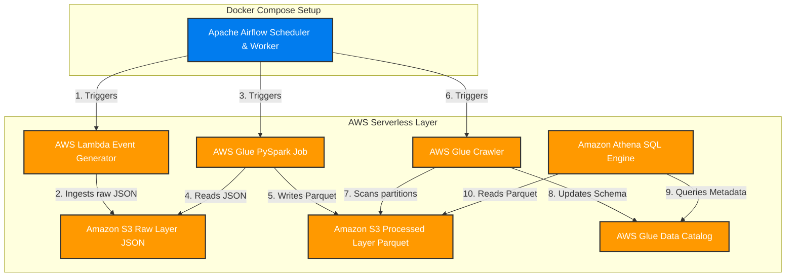

# SaaS Product Analytics Platform

[](https://www.python.org/)
[](https://airflow.apache.org/)
[](https://www.docker.com/)
[](https://aws.amazon.com/s3/)
[](https://aws.amazon.com/glue/)
[](https://aws.amazon.com/athena/)

An end-to-end serverless AWS Data Engineering pipeline designed to simulate, ingest, transform, catalog, and query product usage analytics from a SaaS application. The pipeline is orchestrated locally using a **Docker-based Apache Airflow cluster** and utilizes AWS Lambda, S3, Glue, and Athena.

---

## Table of Contents
- [Project Architecture](#project-architecture)
- [Tech Stack](#tech-stack)
- [Local Project Structure](#local-project-structure)
- [AWS Resource Configurations](#aws-resource-configurations)
- [S3 Data Lake Layout](#s3-data-lake-layout)
- [Data Schema & Validation Rules](#data-schema--validation-rules)
- [How to Run the Project](#how-to-run-the-project)
- [SQL Analytics & Validation](#sql-analytics--validation)
- [Project Screenshots](#project-screenshots)

---

## Project Architecture



---

## Tech Stack

- **Orchestration**: Apache Airflow 3.3.0 (Docker Compose)
- **Data Ingestion**: AWS Lambda (simulating SaaS product usage events)
- **Data Storage**: Amazon S3 (Raw JSON layer, Processed Parquet layer, Athena query results)
- **Data Processing**: AWS Glue ETL (PySpark Spark SQL engine)
- **Metadata Management**: AWS Glue Crawler & AWS Glue Data Catalog
- **Analytics Engine**: Amazon Athena (Serverless SQL engine)
- **Monitoring & IAM**: AWS IAM (Service role mapping) & AWS CloudWatch Logs

---

## Local Project Structure

```text
saas-product-analytics-platform/
├── airflow/
│   └── dags/
│       └── saas_product_pipeline_dag.py
├── architecture/
│   └── architecture.png
├── glue/
│   └── saas_products_etl.py
├── lambda/
│   └── lambda_function.py
├── screenshots/
│   ├── airflow_dag_graph_view.png
│   ├── athena_query_results.png
│   ├── glue_crawler_success.png
│   ├── glue_data_catalog_table.png
│   ├── glue_etl_job_success.png
│   ├── lambda_function.png
│   ├── lambda_success_logs.png
│   ├── s3_bucket_structure.png
│   └── successful_dag_run.png
├── sql/
│   ├── analytics_queries.sql
│   └── validation_queries.sql
├── .env
├── .gitignore
├── .python-version
├── docker-compose.yml
├── main.py
├── pyproject.toml
├── requirements.txt
└── uv.lock
```

---

## AWS Resource Configurations

| Service | Resource Name | Purpose / Responsibility |
| :--- | :--- | :--- |
| **S3 Bucket** | `de-saas-platform-san` | Stores raw source JSONs, transformed Parquet files, and Athena query results |
| **Lambda Function** | `saas-event-generator` | Serverless Python generator that produces mock SaaS actions |
| **Glue Job** | `saas-events-etl` | Serverless Spark job executing deduplication and partition formatting |
| **Glue Crawler** | `saas-events-crawler` | Automatically reads partitions and populates metadata catalog tables |
| **Glue Database** | `saas_events_db` | Logical metadata database grouping crawled Athena tables |
| **Athena Table** | `saas_events` | External analytics schema table mapped directly to S3 Parquet paths |
| **Lambda IAM Role**  | `saas-lambda-role`            | Execution role for AWS Lambda event simulator |
| **Glue IAM Role**    | `saas-glue-role`              | Execution role for AWS Glue ETL job and Crawler |
| **Airflow IAM Role** | `saas-events-role`            | Role providing permissions for AWS services triggered by the pipeline |

---

## S3 Data Lake Layout

```text
de-saas-platform-san/
├── raw/                                     # Raw JSON storage zone
│   └── year=YYYY/
│       └── month=MM/
│           └── day=DD/
│               └── events_YYYYMMDD_HHMMSS.json
├── processed/                               # Transformed date-partitioned Parquet zone
│   └── year=YYYY/
│       └── month=MM/
│           └── day=DD/
│               └── part-00000.parquet
├── athena-results/                          # Output cache folder for Athena query results
├── dags/                                    # Airflow backup DAG folder
└── logs/                                    # Engine runtime log storage directory
```

---

## Data Schema & Validation Rules

### Raw JSON Schema

```json
{
  "events": [
    {
      "event_id": "EVT100001",
      "user_id": 105,
      "workspace_id": "WS15",
      "organization_id": "ORG10",
      "event_type": "login",
      "device": "Windows",
      "browser": "Chrome",
      "country": "India",
      "subscription_plan": "Pro",
      "timestamp": "2026-07-10T09:15:12Z"
    }
  ]
}
```

### Cleansing & Validation Policy

The AWS Glue PySpark job enforces the following pipeline schema rules:

- **Mandatory Fields (NOT NULL)**: Records are filtered out if any of the following fields are null:
  - `event_id`, `user_id`, `organization_id`, `event_type`, `country`, `subscription_plan`, `timestamp`
- **Optional Fields (Allowed NULL)**: May remain empty:
  - `device`, `browser`
- **Deduplication**: Rows containing duplicate `event_id` keys are dropped. Repeated entries for `user_id`, `organization_id`, or `workspace_id` are expected and are **not** removed.

---

## How to Run the Project

> [!IMPORTANT]
> **Prerequisites**
>
> You must have **Docker** and **Docker Compose** installed on your system.

### Step 1: Configure Your Environment File

Create a file named `.env` in the project's root directory containing the required properties:

```env
# Airflow deployment configuration
AIRFLOW_UID=50000
FERNET_KEY=your_generated_fernet_key

# AWS Authentication (provide credentials with permissions to your AWS resources)
AWS_ACCESS_KEY_ID=AKIAxxxxxxxxxxxxxxxx
AWS_SECRET_ACCESS_KEY=xxxxxxxxxxxxxxxxxxxxxxxxxxxxxxxxxxxxxxxx
AWS_DEFAULT_REGION=ap-south-1
AWS_REGION=ap-south-1
```

> [!TIP]
> You can generate a random `FERNET_KEY` by running:
> `python -c "import base64, secrets; print(base64.urlsafe_b64encode(secrets.token_bytes(32)).decode())"`

### Step 2: Initialize Airflow Database
Run the setup service to map directories, initialize the database schema, and create the default admin user:
```bash
docker-compose up airflow-init
```
Upon completion, the initialization container should exit with code `0`.

### Step 3: Launch Airflow Containers
Spin up the Airflow scheduler, webserver, worker, triggerer, and backing databases:
```bash
docker-compose up -d
```

### Step 4: Run and Orchestrate the Pipeline
1. Open your browser and log into [http://localhost:8080](http://localhost:8080) (Credentials: `airflow` / `airflow`).
2. Search for the `saas_product_pipeline` DAG.
3. Toggle the DAG switch to **Unpause** (enabling the scheduler).
4. Click the **Trigger DAG** (play button) to launch the pipeline execution.

### Step 5: Shut Down the Cluster
To stop all services and release local resources:
```bash
docker-compose down
```

---

## SQL Analytics & Validation

Once the pipeline successfully finishes processing a DAG run, run these query definitions in the Amazon Athena console:

### Analytics Queries ([`sql/analytics_queries.sql`](file:///d:/AI%20Engineer/Data%20Engineering/Projects/saas-product-analytics-platform/sql/analytics_queries.sql))
```sql
-- Count of events grouped by type
SELECT
    event_type,
    COUNT(*) AS total_events
FROM saas_events
GROUP BY event_type
ORDER BY total_events DESC;

-- Distribution of active subscribers
SELECT
    subscription_plan,
    COUNT(*) AS total_events
FROM saas_events
GROUP BY subscription_plan
ORDER BY total_events DESC;

-- Daily event volume
SELECT
    DATE(timestamp) AS event_date,
    COUNT(*) AS total_events
FROM saas_events
GROUP BY DATE(timestamp)
ORDER BY event_date;
```

### Data Validation Queries ([`sql/validation_queries.sql`](file:///d:/AI%20Engineer/Data%20Engineering/Projects/saas-product-analytics-platform/sql/validation_queries.sql))
```sql
-- Verify null constraints
SELECT *
FROM saas_events
WHERE event_id IS NULL
   OR user_id IS NULL
   OR organization_id IS NULL
   OR event_type IS NULL
   OR country IS NULL
   OR subscription_plan IS NULL
   OR timestamp IS NULL;

-- Verify event deduplication
SELECT
    event_id,
    COUNT(*) AS duplicate_count
FROM saas_events
GROUP BY event_id
HAVING COUNT(*) > 1;
```

---

## Project Screenshots

The `screenshots/` directory contains actual verification images of the pipeline executions:

- [s3_bucket_structure.png](file:///d:/AI%20Engineer/Data%20Engineering/Projects/saas-product-analytics-platform/screenshots/s3_bucket_structure.png) — S3 bucket structure and raw/processed folder layout.
- [lambda_function.png](file:///d:/AI%20Engineer/Data%20Engineering/Projects/saas-product-analytics-platform/screenshots/lambda_function.png) — AWS Lambda function settings and event generation code configurations.
- [lambda_success_logs.png](file:///d:/AI%20Engineer/Data%20Engineering/Projects/saas-product-analytics-platform/screenshots/lambda_success_logs.png) — AWS Lambda event generation logs and payload size outputs in CloudWatch.
- [glue_etl_job_success.png](file:///d:/AI%20Engineer/Data%20Engineering/Projects/saas-product-analytics-platform/screenshots/glue_etl_job_success.png) — Successful execution graphs of the AWS Glue PySpark ETL job.
- [glue_crawler_success.png](file:///d:/AI%20Engineer/Data%20Engineering/Projects/saas-product-analytics-platform/screenshots/glue_crawler_success.png) — AWS Glue Crawler run details and metadata catalog sync records.
- [glue_data_catalog_table.png](file:///d:/AI%20Engineer/Data%20Engineering/Projects/saas-product-analytics-platform/screenshots/glue_data_catalog_table.png) — Mapped table schemas and active partitions inside the AWS Glue Data Catalog.
- [athena_query_results.png](file:///d:/AI%20Engineer/Data%20Engineering/Projects/saas-product-analytics-platform/screenshots/athena_query_results.png) — Query verification results and analytics metrics outputs in Amazon Athena.
- [airflow_dag_graph_view.png](file:///d:/AI%20Engineer/Data%20Engineering/Projects/saas-product-analytics-platform/screenshots/airflow_dag_graph_view.png) — Executed task dependencies graph view in the Airflow Web interface.
- [successful_dag_run.png](file:///d:/AI%20Engineer/Data%20Engineering/Projects/saas-product-analytics-platform/screenshots/successful_dag_run.png) — Active historical status overview of the successful local Airflow DAG run.
